# Application Modernization Web App - Rest API
Deployment Guide

## Prerequisites
- Any OS with .NET Core 3.1 is installed(https://dotnet.microsoft.com/download/dotnet/3.1). (Required)
- Visual Studio 2019 with Visual C# Web Feature is installed. (Required if you want to test under Windows or view Application Insights in Visual Studio)
- MS SQL Server 2017. (Required)
- Docker with docker-compose. (Required)
- Chrome with Postman is installed. (Optional, required to verify REST API only) 
- Gitlab account

Check https://docs.microsoft.com/en-us/sql/linux/quickstart-install-connect-docker?view=sql-server-linux-2017#requirements
You must make sure exist at least 2G RAM/disk space to run sqlserver 2017 docker container properly.

## Configuration

### Application Insights(only need if you want to view Application Insights in Azure)
Configure `ApplicationInsights.InstrumentationKey` in `Backend/appsettings.json`, please refer https://docs.microsoft.com/en-us/azure/azure-monitor/app/asp-net-core.

### Database Setup
Create a new database 'Dev'(used in Postman environment later and please not use 'DevTest' because it is test database name used in test) with login user name/password pair `sa`/`myPass123` 
otherwise please modify your login user name/password in `AppSettings.ConnectionString` of `Backend/appsettings.json` and `Backend.Tests/appsettings.Test.json`.
`Backend.UnitTests/appsettings.CI.json` has been configured to work with `.gitlab-ci.yml` sql server service and please not modify.
Create the database schema through script files in `Sqls` with order `1DBCreateScript.sql`,`2DB_changes.sql`,`3DB_testdata.sql`,`4DB_changes.sql`, `5DB_changes.sql`, `6DB_changes.sql`.

You can change test database server/dbName in `TestSettings.ServerName`/`TestSettings.DbName` of `Backend.Tests/appsettings.Test.json`.
You can change postman requests database server/dbName through postman environment variable `{{server}}`/`{{dbName}}`,please note you must use `\\` between host and name instance to send as json body properly for example `localhost\\SQLEXPRESS` or you may use real ip address/docker service name of sql server container.

### Jwt Setup
Please check `AppSettings.Jwt` in `Backend/appsettings.json` or any `appsettings.{env}.json`.

### Logging Setup
Please modify `Logging` in `Backend/appsettings.json`, currently it is using default `Debug` level and only use `Debug` level for `AuthController` of ApplicationInsights.

## Local Deployment without docker

Please make sure database settings are right before build solution.

1. Open **Backend.sln** with Visual Studio.
2. Build the solution, ensure it is successful.
3. Test->Run All Tests and ensure all tests are passed and you will find database'DevTest' created during test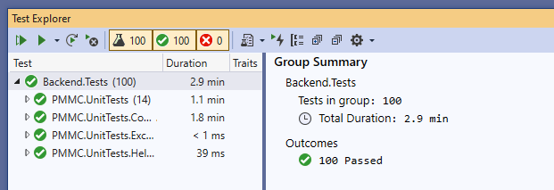
4. Choose `Backend` project and `IIS express` as build target and then Debug->Start without Debuging.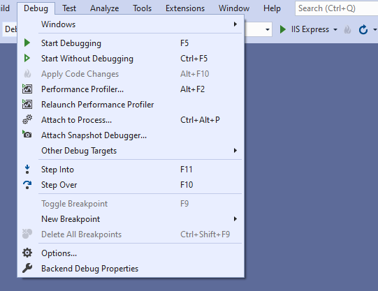
5. Make sure `IIS express` is listen at http://localhost:30208/ otherwise you may change `{{url}}` postman environment variable, import postman collections in 'Docs' folder and verify requests.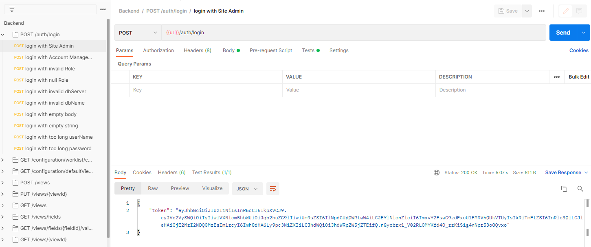
6. Debug->Start Debuging and then you can view Application Insights events using visual studio under window(May be part of Visual Studio Enterprise 2019 feature).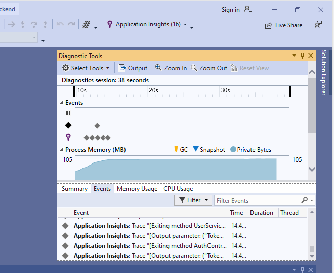

## Test coverage with dotnet commands
Move to `Backend.Tests` folder and execute commands.
```
dotnet tool install --global coverlet.console
dotnet tool install --global dotnet-reportgenerator-globaltool
dotnet test /p:CollectCoverage=true /p:CoverletOutputFormat=opencover /p:CoverletOutput=./coverage/
reportgenerator -reports:./coverage/coverage.opencover.xml -reporttypes:Html -targetdir:./coverage
```

You can will find html coverage report in `Backend.Tests/coverage` folder.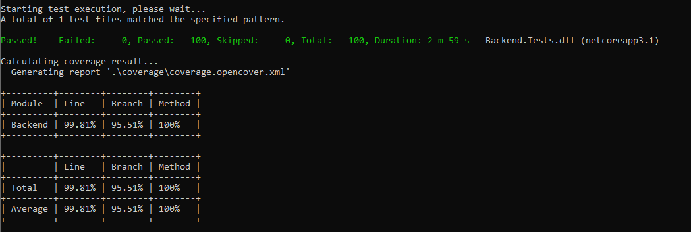


## Docker Deployment

Move to `Backend` folder.
Start sqlserver2017 container with command  `docker-compose up db`(you may check db logs using `docker-compose logs db` if has errors to start sqlserver2017 container and at least 2G RAM is often the problem),
Run bash for db container `docker-compose exec db "bash"` and  then run command `/opt/mssql-tools/bin/sqlcmd -S localhost -U SA -P "myPass123"` in docker container.
You must type `GO` to execute sql commands.
Create new database for web `CREATE DATABASE Dev;`.
Use new ceated database `USE Dev;` and will see such message `Changed database context to 'Dev'`.

You may using sqlserver manage tools to run sqls in sqlserver docker container after create database because it is hard to use command line tool and very slow to run provide sqls and must connect with IP address of machine that hosts docker container.

Follow same steps in section **Database Setup** to run script files in `Sqls` with order `1DBCreateScript.sql`,`2DB_changes.sql`,`3DB_testdata.sql`,`4DB_changes.sql`,`5DB_changes.sql`,`6DB_changes.sql`.
It may be slow to run complete test data for docker and you may change to use `Backend.Tests\TestFiles\TestData.sql` to reduce time.

Build backend api docker image and run with command `docker-compose up web`.

Please use `db` in postman `{{server}}` environment variable and change `dbName` if you use different name, and use `http://localhost:8000/api/ver1` or `http://<docker machine ip>:8000/api/ver1` for docker service `{{url}}` postman environment.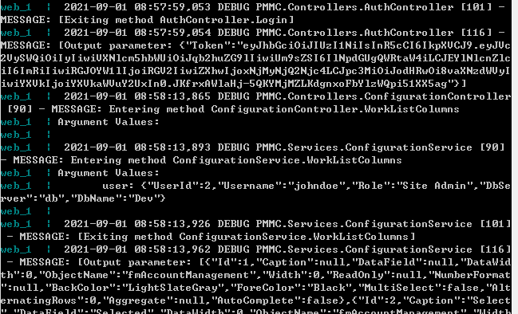

Actually gitlab are using docker service to run CI Jobs.

## Azure Deployment

Move to `Backend` folder.
Follow guide  https://docs.microsoft.com/en-us/azure/azure-monitor/app/create-new-resource to create an Application Insights resource.

Follow guide https://docs.microsoft.com/en-us/cli/azure/install-azure-cli-windows?tabs=azure-cli to install Azure CLI on Windows.

Follow guide https://docs.microsoft.com/en-us/azure/app-service/tutorial-dotnetcore-sqldb-app?pivots=platform-linux to create and configure resource group/sql server on azure.

Follow guide https://docs.microsoft.com/en-us/azure/container-registry/container-registry-tutorial-prepare-registry to create azure container registry and build/push docker image.

You may use similar commands run under `Backend` root folder with `Dockerfile`(replace your own azure container registry) 
like `docker build -t pmmcregistry.azurecr.io/pmmc-backend:latest .` and `az acr login --name pmmcregistry` and `docker push pmmcregistry.azurecr.io/pmmc-backend:latest`.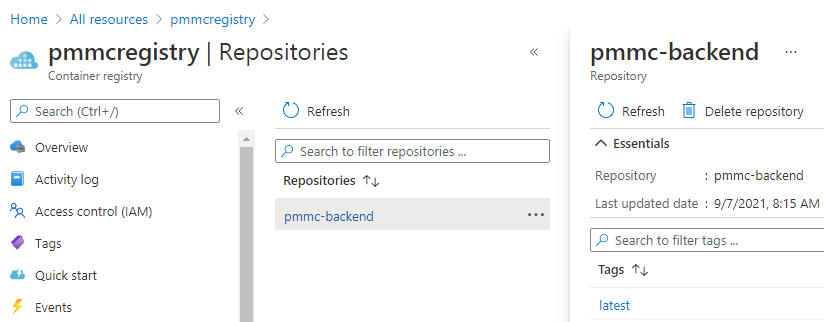

Follow guide https://docs.microsoft.com/en-us/azure/container-registry/container-registry-tutorial-deploy-app to deploy to web app with pushed docker image.

After azure web app is deployed successfully and Settings->Application Insights and click `Turn on Application Insights` and Select existing Application Insights resource.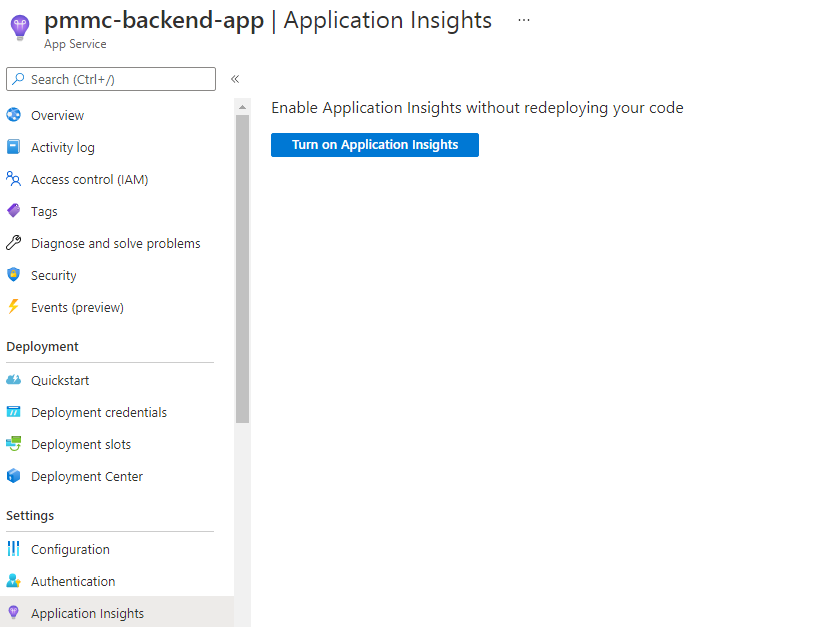

Settings->Configuration->New application settings and add azure sqlserver userId/password with environment variable names `AZURE_DATABASE_USERID`/`AZURE_DATABASE_PASSWORD` and you can also notice `APPINSIGHTS_INSTRUMENTATIONKEY` exists after enable Application Insights.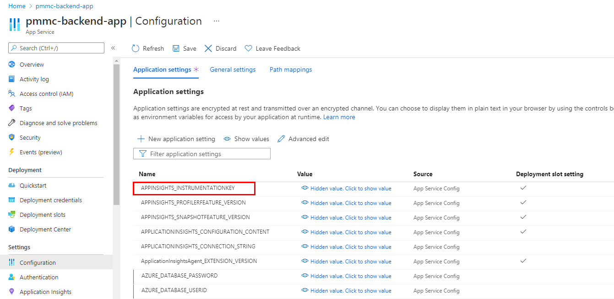

You must click Save button to save configurations and wait azure web app restart.

You must replace postman environment variables with azure web app configurations you can import `Docs/Backend-Env azure.postman_environment.json` and then test with postman requests.

You can check Application Insights logs by Investigate->Transaction search->See all data in the last 24 hours, you may wait some time and click Refresh to see latest logs.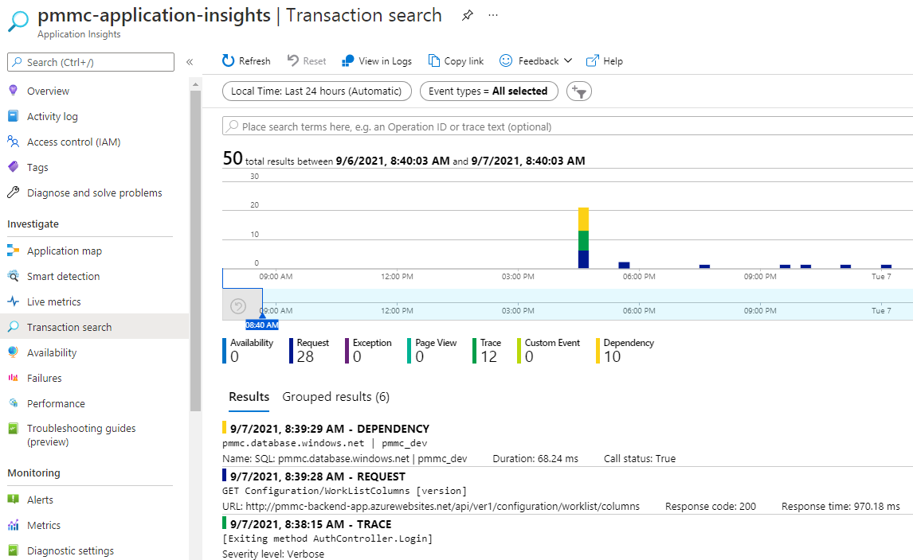

Follow guide https://docs.microsoft.com/en-us/azure/aks/kubernetes-walkthrough-portal to create an AKS cluster.

Then Follow `config.properties.template` to replace with your real azure sqlserver userID/password/application insights instrumentation key and then deploy using commmand `kubectl create configmap pmmc-config --from-env-file=config.properties` and deploy using `kubectl apply --validate -f deployment.yml`.

You may clean up using commands like `kubectl delete configmaps pmmc-config` and `kubectl delete service/pmmc-backend-service deployment/pmmc-backend-deployment`.

Run command `kubectl get services` and wait external ip of pmmc-backend-service is showing real ip address and then use such ip address for postman {{url}} like `http://{{external ip}}/api/ver1` or pmmc-backend-service.<location>.cloudapp.azure.com (where location is the region you selected) like `http://pmmc-backend-service.eastus.cloudapp.azure.com/api/ver1`.

Please note if you use dns and delete and redeploy service you must wait dns record is updated successfully by checking `ping pmmc-backend-service.eastus.cloudapp.azure.com`.

You may assign static ip for kubectl service by follow guide https://docs.microsoft.com/en-us/azure/aks/static-ip.

## Gitlab CI

Please create new gitlab project and git commit current project to gitlab and please make sure `.gitlab-ci.yml` exist in root directory of gitlab project.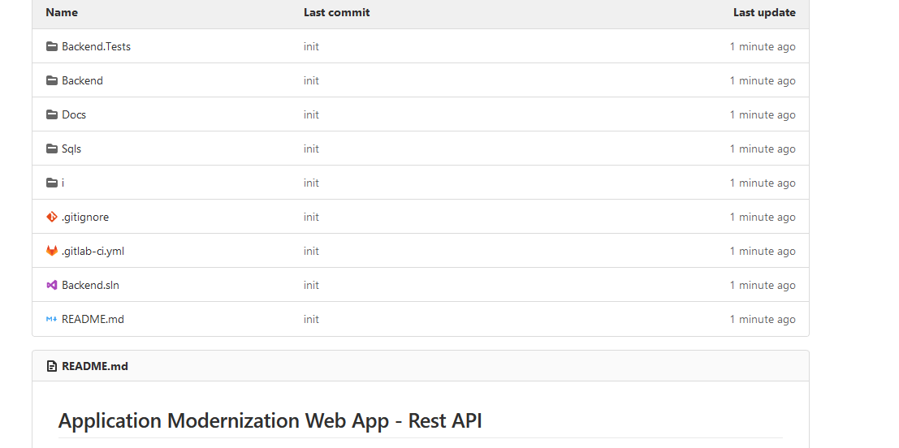

Settings->CI/CD->Variables Please add `CI_REGISTRY`,`CI_REGISTRY_IMAGE`,`CI_REGISTRY_USER`,`CI_REGISTRY_PASSWORD` variables.
You can check azure container registry Settings->Access keys and enable admin user and found registry informaiton there include admin user password.
For example
```
CI_REGISTRY=pmmcregistry.azurecr.io
CI_REGISTRY_IMAGE=pmmcregistry.azurecr.io/pmmc-backend:latest
CI_REGISTRY_PASSWORD=admin user password in azure container registry page
CI_REGISTRY_USER=pmmcregistry
```

Currently only main branch will build docker image.

Please note if you push docker image to azure container registry and azure web app created from docker image will be updated with pushed docker image while kubectl services will not be updated with pushed docker image.

Then you will find `build`/`test` job are finished successfully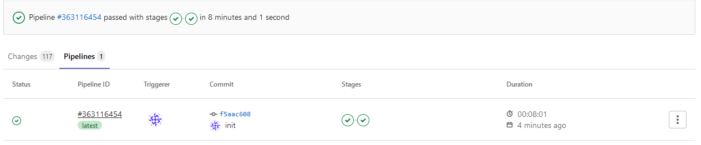, and you will find coverage report are generated in git test job page.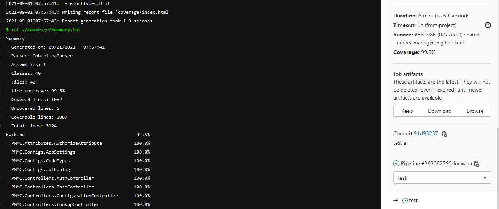

Please note you can download generated Job artifacts and even browse coverage report in gitlab test job page by click `Browse` button.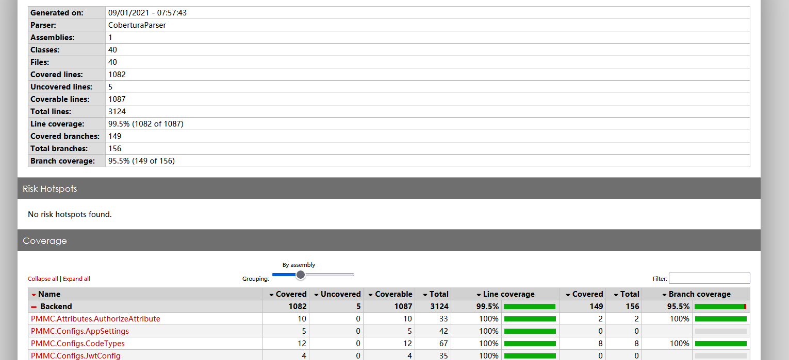

## Azure Deployment Guide
https://docs.google.com/document/d/116cNELTp4g7BwaBGmC6Co71ruEHAIT4i
